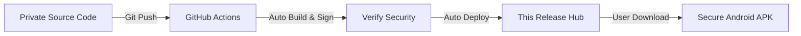

# 🚀 My Apps - Official Release Hub
**Secure, Automated, and High-Quality Android Applications**

[**Catalog**](#-application-catalog) • [**Installation**](#-how-to-install) • [**Security**](#-security--privacy) • [**Support**](#-support--feedback)

---

### 📢 Note to Users
> [!IMPORTANT]
> This repository is the **Central Distribution Point**. All APKs are automatically compiled and signed via GitHub Actions from private source code to ensure the highest security and integrity. No third-party modifications are possible.

---

## 📱 Application Catalog

| App Name | Category | Version | Status | Download |
| :--- | :--- | :--- | :--- | :--- |
| **MyMusic** | 🎵 Music |  | ✅ Stable | [**Get APK**](https://github.com/gobinda101/MyApps-Releases/raw/main/MyMusic-Latest.apk) |
| **PDF Master 101** | 📄 Productivity |  | ✅ Stable | [**Get APK**](https://github.com/gobinda101/MyApps-Releases/releases/download/PDFMaster-v1.0.3/PDFMaster-v1.0.1.apk) |
| **Chat Master** | 💬 Comms |  | ✅ Stable | [**Get APK**](https://github.com/gobinda101/MyApps-Releases/releases/download/ChatMaster-vv1.1.1/ChatMaster-Latest.apk) |
| **HtmlRun** | 🛠️ Dev Tools |  | ✅ Stable | [**Get APK**](https://github.com/gobinda101/MyApps-Releases/releases/download/HtmlRun-v1.0-build-3/HtmlRun-Latest.apk) |
| **Brain Reminder** | 🧠 Utility |  | ✅ Stable | [**Get APK**](https://github.com/gobinda101/MyApps-Releases/releases/download/BrainReminder-v1.0-build-12/app-release.apk) |

---

## 🌟 Featured Applications

### 🎵 MyMusic
*The ultimate ad-free music experience with Material 3 design.*
- 🎨 **Dynamic Theming**: Follows your system wallpaper colors.
- 📂 **Local & Online**: Seamlessly manage your library.
- ⚡ **Optimized Player**: Low battery consumption and high-fidelity audio.

### 🛠️ HtmlRun
*A professional web development environment in your pocket.*
- ✍️ **Advanced Editor**: Full syntax highlighting for HTML/CSS/JS.
- 🌉 **Native Bridge**: Direct access to Android APIs from JavaScript.

### 📄 PDF Master 101
*Your all-in-one document toolbox.*
- ✨ **Smart Scanner**: AI-powered document edge detection.
- 🔒 **Privacy First**: All processing happens 100% offline.

---

## ⚙️ How it Works (Build Pipeline)

---

## 🛠️ How to Install
1. **Download**: Click the **"Get APK"** link for your desired app.
2. **Permissions**: If prompted, allow **"Install from Unknown Sources"** in settings.
3. **Enjoy**: Open the file and follow the setup.

---

## 🛡️ Security & Privacy
- **Automated Builds**: No human interaction with the binary after build.
- **Signed Binaries**: Verified with private signing keys.
- **Offline First**: Most apps function without tracking or data collection.

---

## 💬 Support & Feedback
Found a bug or have a feature request?
- 📧 Email: [your-email@example.com](mailto:your-email@example.com)
- 🌐 Website: [yourportfolio.com](https://yourportfolio.com)

---
© 2026 Gobinda. Built with ❤️ for the Android Community.

