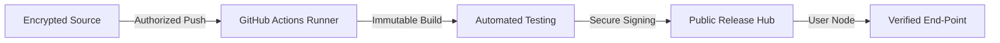

# 🧪 Gobinda101 Labs - Release Hub
**Official Distribution Center for Secure & Automated Android Solutions**

[**Application Catalog**](#-application-catalog) • [**Installation Guide**](#-how-to-install) • [**Security Standards**](#-security-protocol) • [**Contact Us**](#-contact-gobinda101-labs)

---

### 🏛️ Corporate Disclaimer
> [!IMPORTANT]
> This repository is the official outlet for **Gobinda101 Labs** software. All binaries are compiled in isolated cloud environments using our automated CI/CD pipeline to ensure code integrity and user safety.

---

## 📱 Application Catalog

| App Name | Category | Build Version | Status | Distribution |
| :--- | :--- | :--- | :--- | :--- |
| [**MyMusic**](./apps/MyMusic) | 🎵 Audio/Music |  | ✅ Stable | [**Download APK**](https://github.com/gobinda101/MyApps-Releases/raw/main/MyMusic-Latest.apk) |
| [**PDF Master 101**](./apps/PDFMaster101) | 📄 Productivity |  | ✅ Stable | [**Download APK**](https://github.com/gobinda101/MyApps-Releases/releases/download/PDFMaster-v1.0.3/PDFMaster-v1.0.1.apk) |
| [**Chat Master**](./apps/ChatMaster) | 💬 Messaging |  | ✅ Stable | [**Download APK**](https://github.com/gobinda101/MyApps-Releases/releases/download/ChatMaster-vv1.1.1/ChatMaster-Latest.apk) |
| [**HtmlRun**](./apps/HtmlRun) | 🛠️ Development |  | ✅ Stable | [**Download APK**](https://github.com/gobinda101/MyApps-Releases/releases/download/HtmlRun-v1.0-build-3/HtmlRun-Latest.apk) |
| [**Brain Reminder**](./apps/BrainReminder) | 🧠 Utilities |  | ✅ Stable | [**Download APK**](https://github.com/gobinda101/MyApps-Releases/releases/download/BrainReminder-v1.0-build-12/app-release.apk) |

---

## 🌟 Featured Innovations

### 🎵 MyMusic
*Enterprise-grade audio engine meets minimalist Material 3 design.*
- 🎨 **Dynamic Engine**: Real-time interface adaptation to system colors.
- 📂 **Hybrid Library**: Advanced management of local and cloud assets.
- ⚡ **Efficiency**: Proprietary optimizations for extended battery life.

### 🛠️ HtmlRun
*High-performance web runtime and IDE for mobile-first development.*
- ✍️ **Intelli-Editor**: Full-featured IDE with advanced syntax parsing.
- 🌉 **System Bridge**: Securely expose Android primitives to the JS runtime.

---

## 🛡️ Security Protocol (CI/CD)

---

## 🛠️ Installation Procedure
1. **Acquire Binary**: Select **"Download APK"** for the required application.
2. **Security Clearance**: If prompted, authorize **"Install from Unknown Sources"** in Android Settings.
3. **Deployment**: Initialize the package and follow on-screen instructions.

---

## 🛡️ Privacy Commitment
At **Gobinda101 Labs**, user privacy is our core architectural pillar.
- **No Data Harvesting**: Our apps do not collect personal information.
- **Signed Integrity**: Every binary is cryptographically signed.
- **Transparency**: Automated build logs are available via GitHub Actions.

---

## 📩 Contact Gobinda101 Labs
For business inquiries or technical support:
- 📧 Support: [support@gobinda101labs.com](mailto:support@gobinda101labs.com)
- 🌐 Official Portfolio: [gobinda101.dev](https://gobinda101.dev)

---
© 2026 **Gobinda101 Labs**. All Rights Reserved. Engineered for Excellence.

